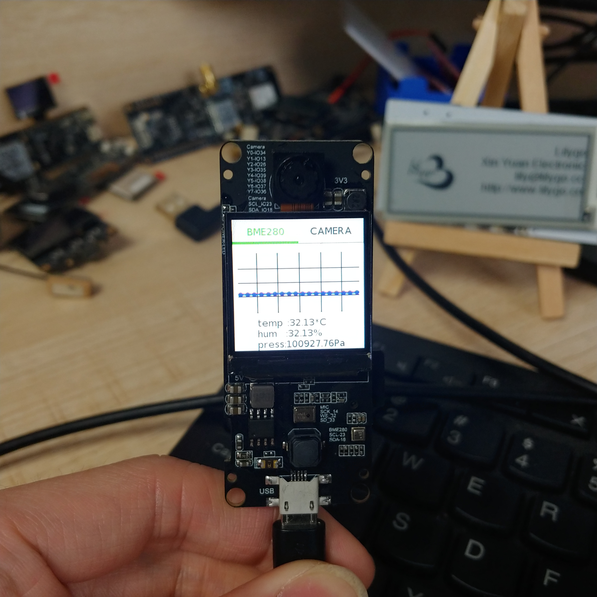
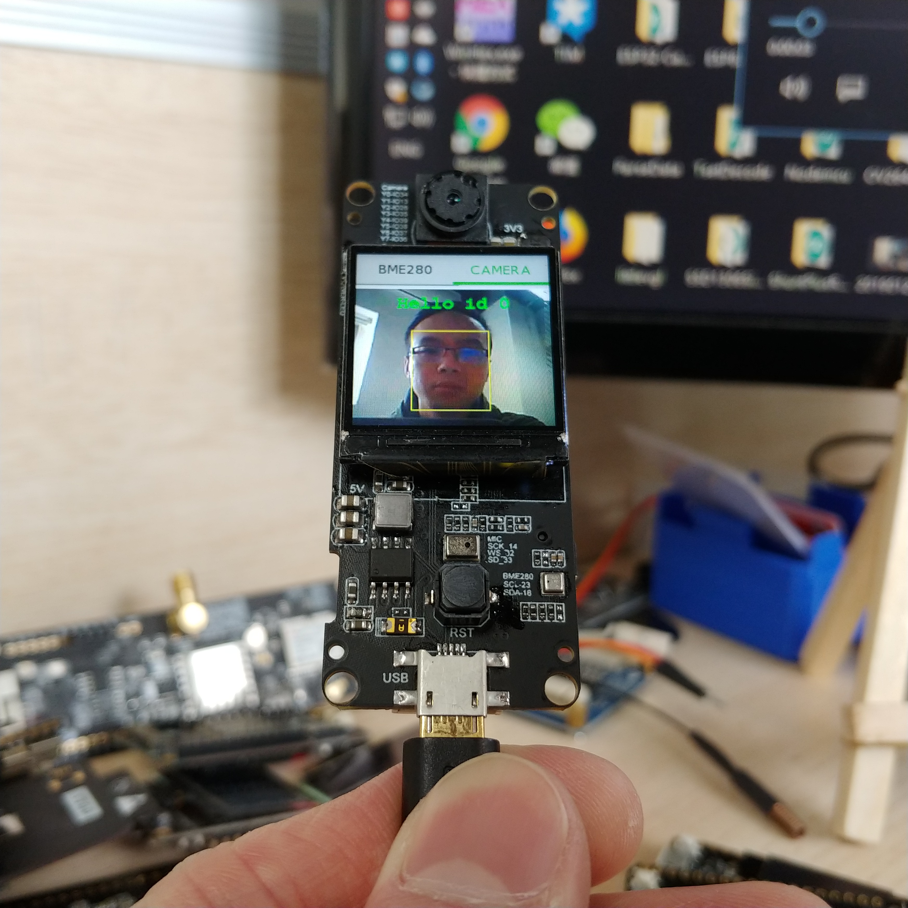

# TTGO Camera Plus

# TTGO Camera && TTGO Camera Plus

| Function    | TTGO T-Câmera     | TTGO T-Câmera Plus   |
| ----------- | ----------------- | -------------------- |
| MIC         | not supported     | supported            |
| SDCard      | not supported     | supported            |
| BME280      | ~~supported~~     | ~~supported~~        |
| Charging    | supported         | supported            |
| I2C         | supported         | supported            |
| Screen      | OLED SSD1306/0.96 | IPS Panel ST7789/1.3 |
| Camera      | OV2640            | OV2640               |
| PIR         | supported         | not supported        |
| User button | supported         | not supported        |
| Core        | ESP32-WROVER-B    | ESP32-DOWDQ6         |
| PSRAM       | 8MBytes           | 8MBytes              |
| FLASH       | 4MBytes           | 4MBytes              |
| UART        | CP2104            | CP2104               |

- The SCCB driver in esp-who uses the IO emulation method. I rewrote it to I2C to drive it so that I can mount multiple devices on the I2C bus ,Need to replace `sccp.c` in the SCCB directory with `esp-who/components/esp32-camera/driver/sccb.c`

- At present, the program is not stable, and the wake-up of the voice conflicts with a certain part of the program. Since the voice wake-up code cannot be viewed, this problem cannot be solved. The code just demonstrates that the TTGO Camera Plus board hardware is intact.

- Since TTGO Camera Plus does not have physical buttons, face information entry will be entered on the web page.

- Turn on the `FACE_DETECT_IN_SCREEN` macro(in main.cpp), face recognition will be displayed in the display, and the microphone will be disabled. The web page will not be viewable. Only face input and camera parameters can be adjusted.

## Board Modify
- The Camera Plus version sold by TTGO will not have the BME280 sensor, because the temperature on the board affects the accuracy of the sensor. The default program does not enable the BME280 function. If necessary, turn on the `ENABLE_BME280` (on app_main.cpp line 35)

## TTGO CAMERA PINS
| Name  | Num    |
| ----- | ------ |
| Y9    | 36     |
| Y8    | 37     |
| Y7    | 28     |
| Y6    | 39     |
| Y5    | 35     |
| Y4    | 26     |
| Y3    | 13     |
| Y2    | 34     |
| VSNC  | 5      |
| HREF  | 27     |
| PCLK  | 25     |
| XCLK  | 4      |
| SIOD  | 18     |
| SIOC  | 23     |
| PWD   | No use |
| RESET | No use |

## BME280  & IP5306 Pins
| Name | Num |
| ---- | --- |
| SDA  | 18  |
| SCL  | 23  |

## MIC  Pins
| Name     | Num    |
| -------- | ------ |
| I2S_SCLK | 14     |
| I2S_LCLK | 32     |
| I2S_DOUT | 33     |
| I2S_DIN  | No use |

## TFT & SD Card Pins
| Name   | Num |
| ------ | --- |
| MISO   | 22  |
| MOSI   | 19  |
| CLK    | 21  |
| DC     | 15  |
| TFT_CS | 12  |
| TFT_BK | 2   |
| SD_CS  | 0   |

## External extension

## Test Video
[YouTube](https://youtu.be/vVHurYwPiqI)